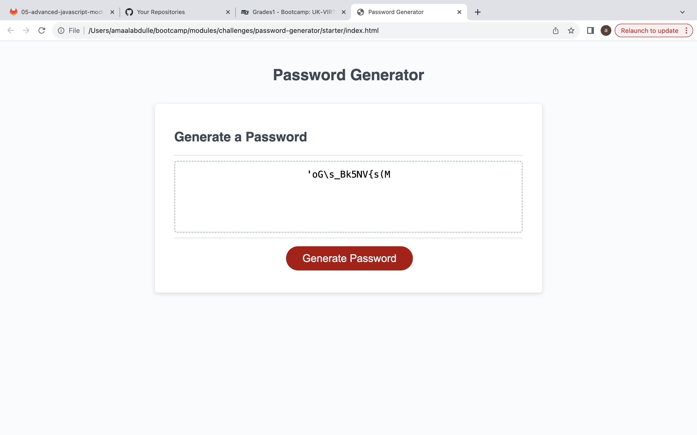

# password-generator
Generating a random password.

## Description

In this weeks challenege, I created an application that can be used to generate a random password based on a set criteria. This applciation is powered by HTML, CSS and JavaScript, with it the majority of it being composed of the latter.

## Installation

No steps required to install project.

## Usage

To generate a random password, the user will first press the generate button. They will then have a sereis of promopts allowing them to enter the length of their chosen password (between 8 and 128 characters). The user will then have the option to select their choice of character types to be included in their password. The generated password will then show in the box.

Note: If the user has no entered a length between 8 and 128 chracaters and chosen at least one special character, then they will not be able to move forware with their generated password untill they do.

Link to deployed website: https://amaalabdulle.github.io/password-generator/

## Credits

Collaborated with the EdX Web Development team. All html & css was suplied by them. Most of the JavaScript code was done by myself.

## License

N/A
